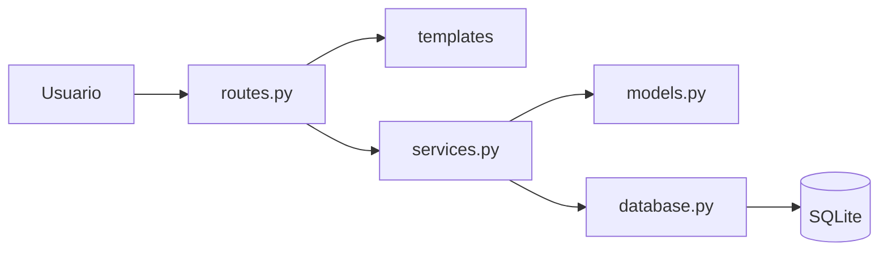

# Arquitectura de la solución

| Campo | Valor |
|---|---|
| Código CI | ARQ-002 |
| Versión | 1.0 |
| Estado | Aprobado |
| Responsable | [SthephaniGP / Analista y documentador] |
| Ubicación | 03_Docs/diseno/arquitectura.md |
| Línea base | LB 1.0 |

## 1. Estilo arquitectónico
Aplicación web monolítica en capas con Flask.

## 2. Componentes

## 3. Responsabilidades
| Componente | CI | Responsabilidad |
|---|---|---|
| routes.py | IMP-004 | Recibe peticiones HTTP y llama a los servicios |
| templates/ | IMP-005 | Interfaz HTML |
| services.py | IMP-002 | Reglas de negocio |
| models.py | IMP-001 | Entidades del dominio |
| database.py | IMP-003 | Conexión y persistencia |

## 4. Decisiones de diseño
| Decisión | Alternativa | Justificación |
|---|---|---|
| Flask | Django | Más ligero para el alcance del ejercicio |
| SQLite | PostgreSQL | Sin instalación adicional |
| Reglas en services.py | Reglas en routes.py | Facilita pruebas y análisis de impacto |

## Historial de cambios del documento
| Versión | Fecha | Solicitud | Descripción |
|---|---|---|---|
| 1.0 | [23/09/2026] | Línea base inicial | Versión inicial aprobada | 