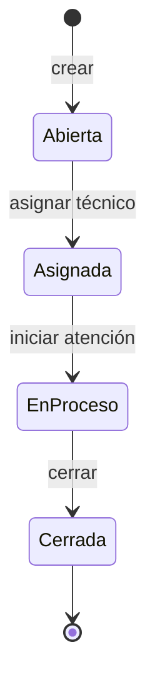

# Diagrama de estados de la solicitud

| Campo | Valor |
|---|---|
| Código CI | DIA-003 |
| Versión | 1.0 |
| Estado | Aprobado |
| Responsable | [SthephaniGP / Analista y Documentadora] |
| Ubicación | 03_Docs/diseno/diagrama-estados.md |
| Línea base | LB 1.0 |

## 1. Diagrama

## 2. Tabla de transiciones
| Estado origen | Acción | Estado destino | Regla |
|---|---|---|---|
| (nuevo) | Crear solicitud | Abierta | RN-02 |
| Abierta | Asignar técnico | Asignada | RN-03 |
| Asignada | Iniciar atención | En proceso | RN-04 |
| En proceso | Cerrar | Cerrada | RN-04 |
| Cerrada | Cualquier acción | No permitido | RN-05 |

## Historial de cambios del documento
| Versión | Fecha | Solicitud | Descripción |
|---|---|---|---|
| 1.0 | [23/09/2026] | Línea base inicial | Versión inicial aprobada |
