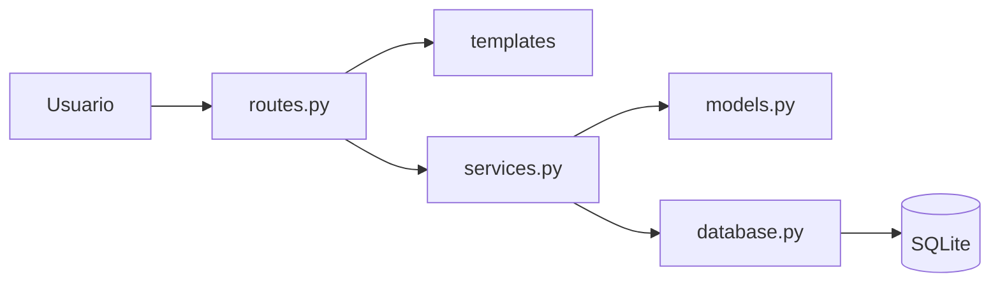
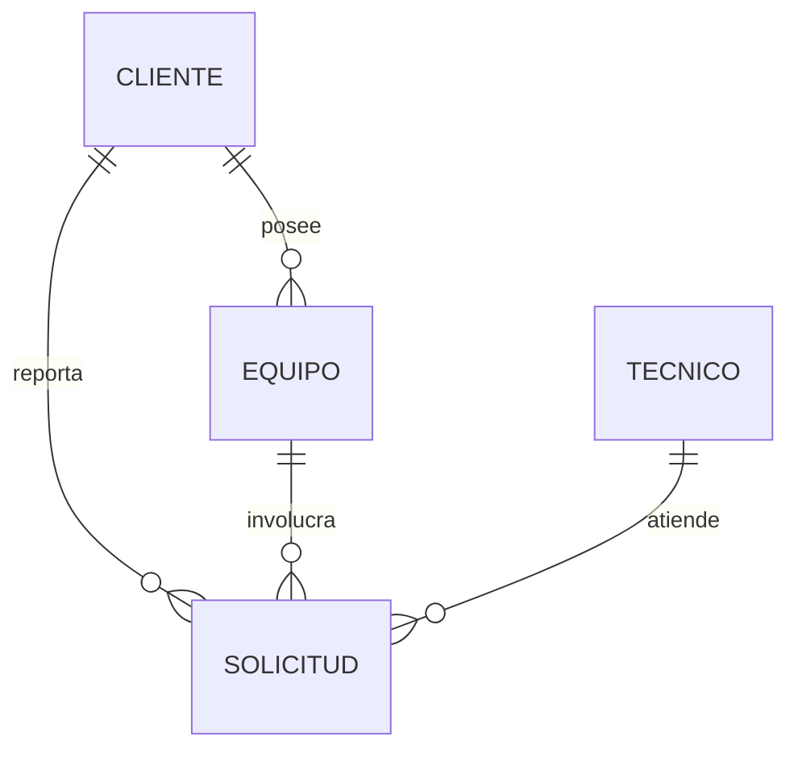
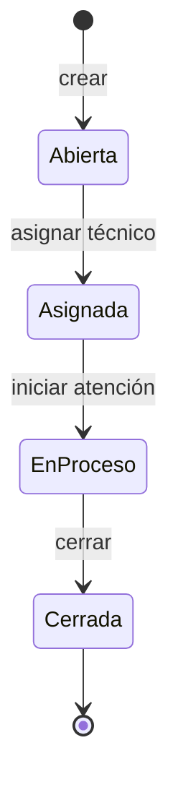

# DIS-001 - Diseño del Sistema FixIT

## Información del elemento de configuración

| Campo | Valor |
|---|---|
| Código del CI | DIS-001 |
| Nombre | Diseño del Sistema |
| Proyecto | FixIT |
| Versión | 1.0 |
| Estado | Aprobado |
| Fecha | [23/09/2026] |
| Responsable | [Nombre / Equipo FixIT] |
| Ubicación | 03_Docs/diseno/diseno-sistema.md |
| Línea base | LB 1.0 |

## Historial de versiones

| Versión | Fecha | Descripción del cambio | Responsable |
|---|---|---|---|
| 1.0 | [23/09/2026] | Diseño inicial del sistema | [Equipo FixIT] |

## 1. Descripción general

FixIT es una aplicación web monolítica en capas desarrollada con Flask. Se organiza en tres componentes funcionales:

- Gestión de clientes y equipos.
- Gestión de técnicos.
- Gestión de solicitudes de soporte (creación, asignación, cambio de estado, cierre y consulta).

## 2. Arquitectura

| Componente | CI | Responsabilidad |
|---|---|---|
| routes.py | IMP-004 | Recibe las peticiones HTTP y llama a los servicios |
| templates/ | IMP-005 | Interfaz HTML |
| services.py | IMP-002 | Reglas de negocio |
| models.py | IMP-001 | Entidades del dominio |
| database.py | IMP-003 | Conexión y persistencia |

**Decisiones de diseño**

| Decisión | Alternativa descartada | Justificación |
|---|---|---|
| Flask | Django | Más ligero para el alcance del ejercicio |
| SQLite | PostgreSQL | No requiere instalación adicional |
| Reglas de negocio en services.py | Reglas en routes.py | Facilita las pruebas y el análisis de impacto |

## 3. Entidades principales

### Cliente
- id
- nombre
- contacto

### Equipo
- id
- clienteId
- descripcion

### Tecnico
- id
- nombre

### Solicitud
- id
- clienteId
- equipoId
- tecnicoId (vacío hasta que se asigna)
- descripcion
- estado
- fechaCreacion

> Ajustar los nombres y atributos exactamente a `models.py` y `database.py`.

## 4. Estados de la solicitud

| Estado origen | Acción | Estado destino | Regla |
|---|---|---|---|
| (nueva) | Crear solicitud | Abierta | RN-02 |
| Abierta | Asignar técnico | Asignada | RN-03 |
| Asignada | Iniciar atención | En proceso | RN-04 |
| En proceso | Cerrar | Cerrada | RN-04 |
| Cerrada | Cualquier acción | No permitido | RN-05 |

## 5. Relación entre requisitos y diseño

| Requisito | Elemento de diseño asociado |
|---|---|
| RF-01 Registrar cliente y equipo | Entidades Cliente y Equipo |
| RF-02 Crear solicitud | Entidad Solicitud, estado Abierta |
| RF-03 Asignar técnico | Entidades Tecnico y Solicitud, transición Abierta → Asignada |
| RF-04 Cambiar estado | Diagrama de estados (sección 4) |
| RF-05 Cerrar solicitud | Transición En proceso → Cerrada |
| RF-06 Consultar solicitudes abiertas | Entidad Solicitud, estados distintos de Cerrada |

## 6. Flujo general

### Creación de solicitud
1. El usuario selecciona cliente y equipo e ingresa la descripción.
2. El sistema valida que los datos obligatorios existan.
3. El sistema crea la solicitud en estado Abierta con su fecha de creación.
4. El sistema almacena la información.

### Asignación de técnico
1. El usuario selecciona una solicitud abierta y un técnico.
2. El sistema verifica que ambos existan y que la solicitud no esté cerrada.
3. El sistema registra el técnico y cambia el estado a Asignada.

### Cambio de estado y cierre
1. El técnico selecciona el siguiente estado.
2. El sistema verifica que la transición esté permitida.
3. El sistema actualiza el estado; si es Cerrada, la solicitud queda sin posibilidad de modificación.

### Consulta de solicitudes abiertas
1. El usuario abre el listado.
2. El sistema muestra las solicitudes cuyo estado es distinto de Cerrada.

## 7. Trazabilidad de diseño

Este diseño se deriva de los requisitos definidos en ESP-002 (Historias de usuario) versión 1.0 y de las reglas de negocio de ESP-003 versión 1.0.

Cualquier modificación que afecte la estructura de las entidades, los estados de la solicitud o la arquitectura deberá evaluarse para determinar su impacto sobre este elemento de configuración.