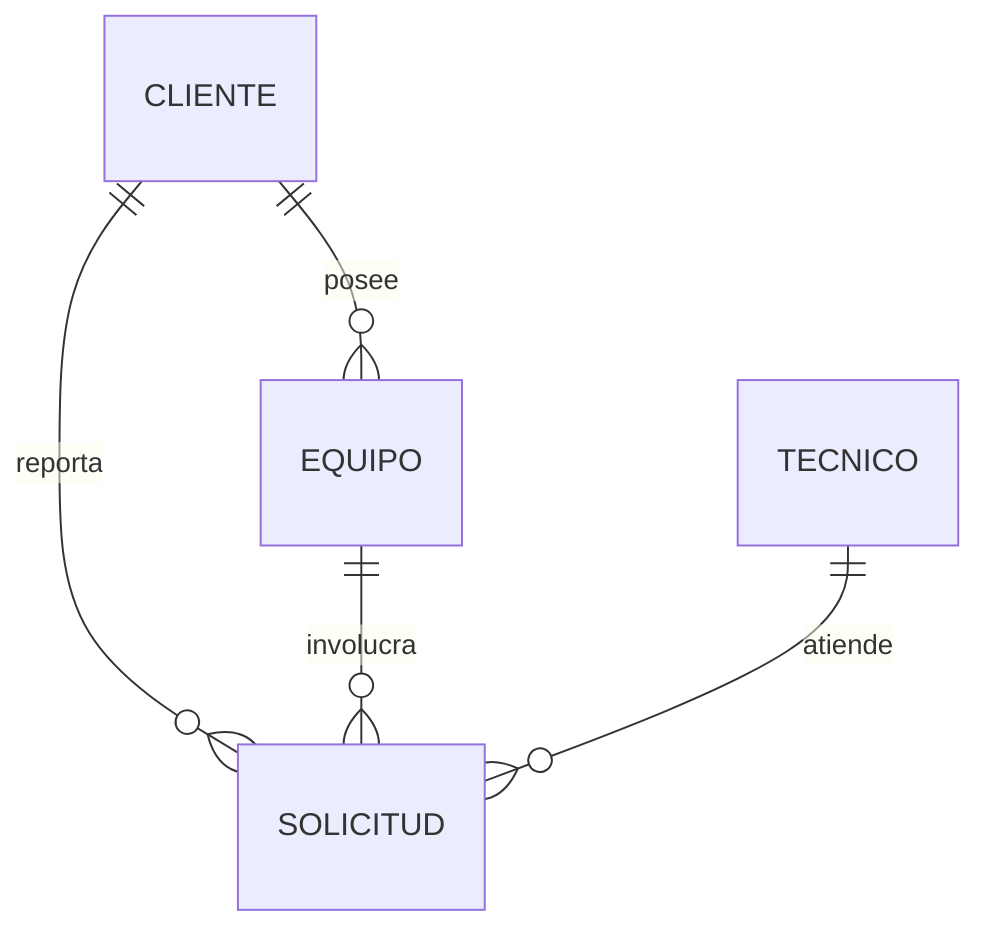

# Modelo de datos

| Campo | Valor |
|---|---|
| Código CI | MOD-004 |
| Versión | 1.0 |
| Estado | Aprobado |
| Responsable | [SthephaniGP / Analista y Documentador] |
| Ubicación | 03_Docs/diseno/modelo-datos.md |
| Línea base | LB 1.0 |

## 1. Entidades y relaciones

## 2. Diccionario de datos
### Cliente
| Campo | Tipo | Restricciones |
|---|---|---|
| id | INTEGER | PK, autoincremental |
| nombre | TEXT | Obligatorio |
| contacto | TEXT | Opcional |

### Equipo
| Campo | Tipo | Restricciones |
|---|---|---|
| id | INTEGER | PK |
| cliente_id | INTEGER | FK a Cliente, obligatorio |
| descripcion | TEXT | Obligatorio |

### Tecnico
| Campo | Tipo | Restricciones |
|---|---|---|
| id | INTEGER | PK |
| nombre | TEXT | Obligatorio |

### Solicitud
| Campo | Tipo | Restricciones |
|---|---|---|
| id | INTEGER | PK |
| cliente_id | INTEGER | FK, obligatorio |
| equipo_id | INTEGER | FK, obligatorio |
| tecnico_id | INTEGER | FK, nulo hasta asignar |
| descripcion | TEXT | Obligatorio |
| estado | TEXT | Abierta, Asignada, En proceso, Cerrada |
| fecha_creacion | TEXT | Obligatorio |

> Ajustar nombres y tipos a `models.py` y `database.py`.

## 3. Cambios previstos (no incluidos en LB 1.0)
Se evaluarán en los CR: campo de prioridad y datos de cierre (solución, fecha, técnico).